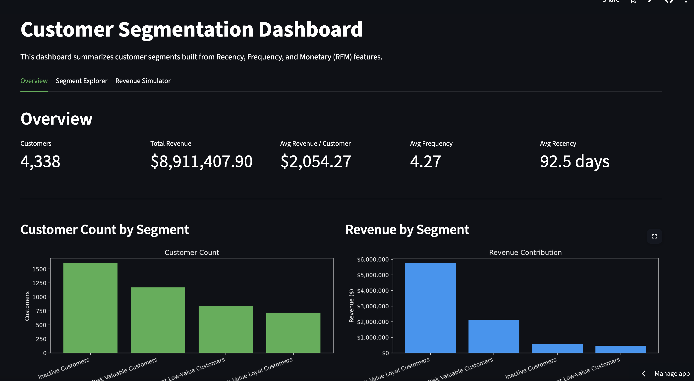

# Customer-Segmentation-for-Targeted-Marketing

This project used KMeans clustering and the UCI Online Retail dataset to cluster customers based on different RFM characteristics and then developed a means of simulating revenue as well as providing A/B testing ideas.

## Live Dashboard

[Click here to explore the interactive app](https://customer-segmentation-for-targeted-marketing-77i5jdl9asjh45jze.streamlit.app/)

**Dashboard Preview:**

## Overview

This project addressed the need for businesses to understand customer behavior so as to optimally strategize for hitting revenue targets. Not all customers contribute to revenue the same, and identifying and segmenting them based on their contributions and behavior can be extremely useful in the implementation of targeted marketing.

The goal of the project was to segment customers based on their purchasing behavior and identify high-value and at-risk groups, as well as other groups still worth considering. It used an RFM framework to reveal recency, frequency, and monetary traits as they pertained to customers and grouped them into four clusters using KMeans.

This led to actionable and easily interpretable customer segments, revenue insights including simulation increased retention rate of certain segments of customers, and development of strategic marketing recommendations to boost customer retention and engagement. An interactive dashboard was also deployed, allowing users to interact with the data, simulate revenue outcomes depending on level of increased retention dependent on customer segment, visualize the clusters in a two-dimensional format, and more.

This project highlights how unsupervised learning can directly translate to actionable business strategy.

## Dataset

The dataset used was the UCI Online Retail dataset, linked and available for download here: https://archive.ics.uci.edu/dataset/352/online+retail

It contains transaction-level data, customer IDs, timestamps, product information, and prices. It has about ~500k rows of raw data, and after data cleaning about ~400k rows. 

### Data Preparation

#### Data Cleaning

Data cleaning involved removing rows with missing Customer IDs, removing cancelled transactions (InvoiceNo starting with "C"), filtering negative quantities (returns), and creating a column TotalPrice = Quantity * UnitPrice

#### Feature Engineering

The concept of RFM is extremely important to understanding customer behavior and their subsequent segmentation. Recency refers to how many days since last purchase, and is a measure of how recently a customer engaged. Frequency is a measure of number of transactions, and represents customer engagement level. Monetary is total spend, and is a metric to evaluate customer value. These features were aggregated to the customer level, i.e. one observation per Customer ID. 

#### Scaling

Features were standardized using StandardScaler, as KMeans is a distance-based method of clustering, and scaling prevents one feature from dominating. 

## Modeling Approach

For the clustering, the method used was KMeans, and multiple values of k were tested. To finally select the optimal k for the task, both the elbow method and silhouette score were used to determine the value. The optimal k turned out to be k = 4. 

## Customer Segments

### High-Value Loyal Customers

These customers were customers that had high recency, indicating they had recently made purchases, high frequency, pointing to multiple transactions, and high monetary value, meaning they were spending significant amounts of money in relation to total revenue. They were the majority contributors to revenue. 

### At-Risk Valuable Customers

These customers were previously high spenders who had dropped off with a current lower monetary value, had a declining recency meaning more time since their last purchase than normal, and were at risk for churn.

### Recent Low-Value Customers

These customers had recent purchase activity, but low frequency and a relatively low contribution to total revenue. They were early-stage customers and new shoppers at the retail establishment.

### Inactive Customers

These customers had high recency, meaning they had not made a purchase for a long time, had low frequency and thus very few transactions, and low monetary values, contributing the least out of the four segments to total revenue. 

## Key Insights

**Revenue Concentration:**

- High-Value Loyal Customers:
  - ~65% of total revenue
- High-Value + At-Risk:
  - ~90% of total revenue
 

  **Customer Distribution:**

  The majority of customers were either of low value or inactive

  Importantly, revenue is highly concentrated between two segments, thus highlighting the critical need for retention of those two segments to protect and boost revenue.

  ## Revenue Impact Simulation

For the revenue impact simulation, the revenue effect of improving performance for one of the most important segments, At-Risk Valuable Customers, was observed. This segment represented a meaningful share of revenue contribution. However, they were slowly moving towards inactivity, and as their loss would have a significant negative impact on revenue, improving retention would not only mitigate this negative outcome but also increase revenue from its current baseline. An assumption was made that it would be possible to generate a 10% uplift of these hypothetical At-Risk Valuable customers. Increased revenue was modeled as segment revenue x assumed uplift rate, and the simulated 10% uplift showed that even relatively small improvements in retention can have a meaningful and positive impact on revenue, supporting the necessity to strategize manners for boosting retention and engagement of these customers. 

  ## A/B Testing Strategy

  ### Segment targeted:

  At-Risk Valuable Customers

  ### Business Problem

At-Risk Valuable customers are the second highest contributors to total revenue (~25% and only second to High-Value Loyal Customers), but also are drifting away and are at risk of churn, with both increasing recency (days since last purchase) and decreasing frequency (number of transactions made). If these customers disengage to the point of inactivity, revenue to the company will take a significant hit. 

### Control vs Treatment

- Control: standard post-purchase communication, no special outreach
- Treatment: personalized re-engagement campaign such as a targeted discounts in conjunction with "we miss you emails" and reminders, curated recommendation emails

### Hypothesis

The hypothesis is that a personalized retention campaign will re-incentivize customers to engage and lead to an increased repeat purchase rate and revenue contribution among this customer segment.

### Metrics for Evaluation

**Primary Metric:**

- Repeat purchase rate within 30 days

**Secondary Metric:**

- Revenue contribution per targeted customer
- Average order value
- Click-through rate or conversion rate

**Guardrail Metrics:**

- Discount cost
- Margin impact
- Unsubscribe rate

## Dashboard

An interactive dashboard was developed using Streamlit to give users the ability to interact with the project data, outcomes, and simulations. It features customer segment distribution, revenue contribution per segment, PCA visualization of segments, and most importantly a revenue impact simulator that allows users to test different retention rates of different segments and observe the subsequent impact on revenue. 

View the dashboard here: https://customer-segmentation-for-targeted-marketing-77i5jdl9asjh45jze.streamlit.app/

## Repository Structure

.streamlit/ - contains .toml file for dashboard styling

images/

notebooks/

src/ - contains following files:

    - preprocessing.py:
      - load raw retail CSV
      - clean transactions
      - build RFM table

      
    - clustering.py:
      - log transform + scale RFM
      - evaluate KMeans across k
      - fit final customer segments
      - add PCA coordinates
      - build a cluster profile table

      
    -utils.py:
      - revenue by segment
      - revenue by share %
      - revenue uplift simulation
      - save dataframe/simple chart helpers

      
dashboard.py - file for creating Streamlit app

requirements.txt

rfm_with_segments.csv - necessary for dashboard configuration

## How to Run

pip install -r requirements.txt

streamlit run dashboard.py

## Future Improvements

- Real implementation of A/B testing
- Time-based modeling
- Fleshed out recommendation systems
- Deployment enhancements

